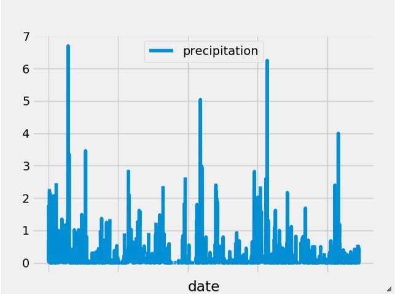

# Surfs Up!

## Description

This project investigates a fictional trip to Hawaii. It analyzes the weather data for Hawaii collected at various weather stations to predict typical weather during the trip.
This is done in the Jupyter notebook, while a Flask app is also created that allows data calls from a SQLite database using SQLAlchemy and Flask.

The steps followed in the analysis are:

The first step is to clean the data using Pandas notebook by removing any NAN values present in the dataset.

In this step, SQLAlchemy is used to access the sqlite database (hawaii.sqlite) available in the Resources folder. The two csv files hold the same data from the SQL database tables.

Next step is to create a weather API to do a climate analysis based on the data that was stored in the SQLite database. Using pandas dataframe  In this step, the weather data was analysed using SQLAlchemy queries and Pandas to create data frames and plotted graphs using Matplotlib.

The final step was to create a Flask app to simulate the generation of api calls from a SQL database. This application is run on the local host.